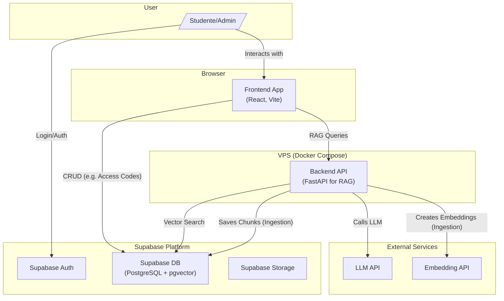

# Sezione 2: Architettura di Alto Livello

### 2.1 Riepilogo Tecnico

L'architettura di FisioRAG è progettata come un'applicazione **monolitica containerizzata** con una struttura di repository **monorepo**. Il frontend, costruito in **React (con TypeScript e Vite)**, interagirà con due API principali: un backend **FastAPI (Python)** per la logica RAG e le **API di Supabase** per l'autenticazione e il CRUD. La logica di business complessa del backend sarà orchestrata dal framework **LangChain**, che semplificherà l'implementazione della pipeline di ingestione e della catena di generazione delle risposte. L'intera applicazione sarà deployata su un **Virtual Private Server (VPS)** utilizzando **Docker Compose**. **Supabase** fornirà il database PostgreSQL con `pgvector`, l'autenticazione e la gestione dello storage. Questa architettura realizza gli obiettivi del PRD fornendo una base solida e a basso costo (<30€/mese), ottimizzata per la velocità di sviluppo e la sicurezza.

### 2.2 Piattaforma e Scelta dell'Infrastruttura

*   **Piattaforma Raccomandata**: Un approccio ibrido:
    *   **Compute**: Un **Virtual Private Server (VPS)** a basso costo (es. Hetzner) per ospitare i container Docker.
    *   **Backend-as-a-Service (BaaS)**: **Supabase** per Database, Vector Store, Autenticazione e Storage.
*   **Servizi Chiave**:
    *   **VPS**: Docker Engine, Docker Compose.
    *   **Supabase**: PostgreSQL con `pgvector`, Supabase Auth, Supabase Storage.
*   **Deployment Host e Regioni**: Un singolo VPS localizzato in Europa.

### 2.3 Struttura del Repository

*   **Struttura**: **Monorepo**.
*   **Tool per Monorepo**: **pnpm workspaces**.
*   **Organizzazione dei Pacchetti**:
    *   `apps/`: Conterrà le applicazioni deployabili (`web`, `api`).
    *   `packages/`: Conterrà il codice condiviso (`shared-types`).

### 2.4 Diagramma dell'Architettura di Alto Livello



### 2.5 Diagramma di Contesto C4

Questo diagramma mostra una visione di alto livello del sistema FisioRAG, posizionandolo in relazione ai suoi utenti e ai sistemi esterni da cui dipende.

```mermaid
graph TD
    subgraph "FisioRAG System"
        direction LR
        style FisioRAG System fill:#1f2937,stroke:#38bdf8,stroke-width:2px,color:#fff
        WebApp["Web Application <br/> (React, FastAPI)"]
        style WebApp fill:#38bdf8,stroke:#fff
    end

    subgraph "Users"
        direction TB
        Admin[Admin <br/> (Professore)]
        style Admin fill:#9ca3af,color:#000
        Student[Studente]
        style Student fill:#9ca3af,color:#000
    end

    subgraph "External Dependencies"
        direction TB
        Supabase["Supabase <br/> (Auth, DB, Storage)"]
        style Supabase fill:#4b5563,color:#fff
        LLM_API["External LLM API"]
        style LLM_API fill:#4b5563,color:#fff
        Embedding_API["External Embedding API"]
        style Embedding_API fill:#4b5563,color:#fff
    end

    Admin -- "Manages" --> WebApp
    Student -- "Uses for studying" --> WebApp
    WebApp -- "Depends on" --> Supabase
    WebApp -- "Depends on" --> LLM_API
    WebApp -- "Depends on" --> Embedding_API
```

### 2.6 Pattern Architetturali

*   **Architettura Generale: Monolite Containerizzato con BaaS**: Semplifica lo sviluppo e il deployment, sfruttando i servizi gestiti per ridurre la complessità.
*   **Frontend: Component-Based UI (React)**: Standard per UI moderne.
*   **Backend: Service Layer**: La logica di business complessa (RAG) è isolata in servizi specifici.
*   **Integrazione: Multi-API**: Il frontend comunica sia con l'API del backend custom che con le API di Supabase.
*   **Sicurezza: Row-Level Security (RLS)**: La sicurezza dei dati è imposta a livello di database.
*   **Dati: Retrieval-Augmented Generation (RAG)**: Pattern fondamentale dell'applicazione.

---

