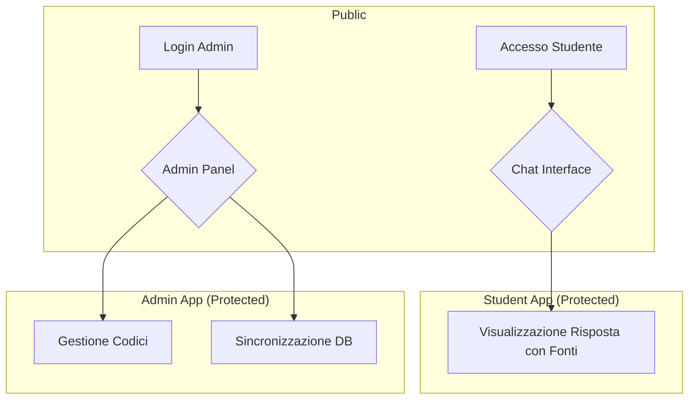
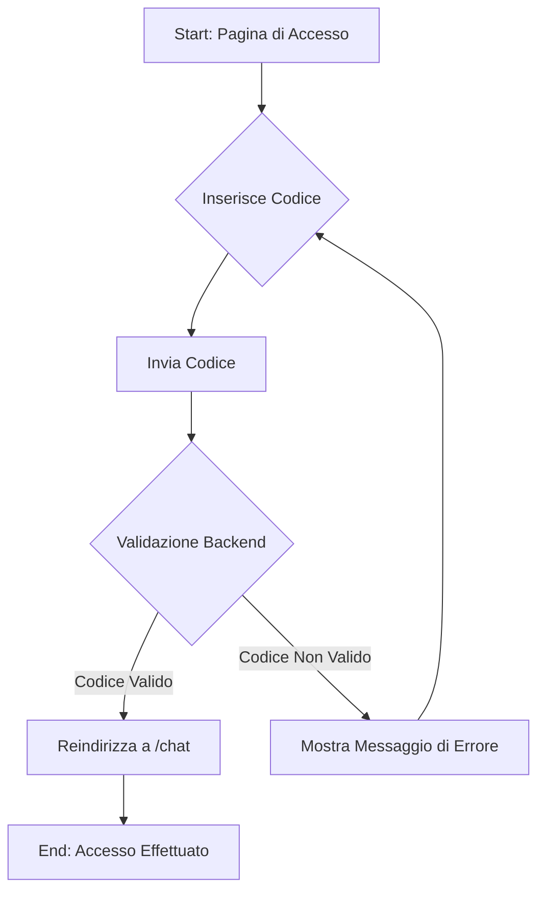
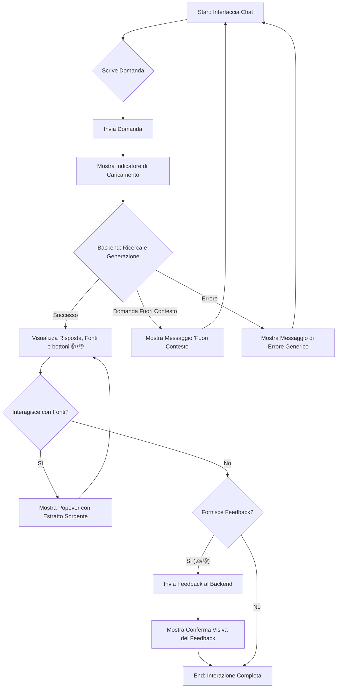
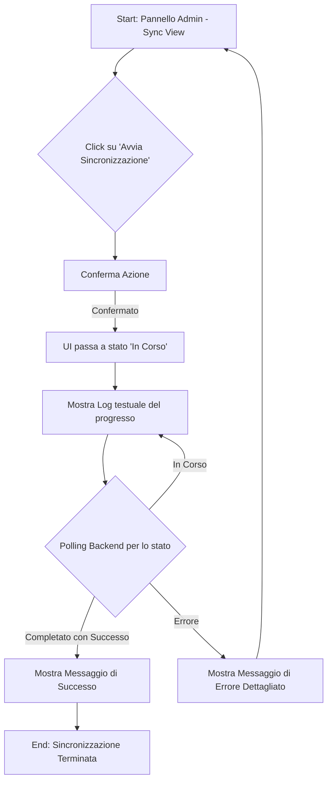
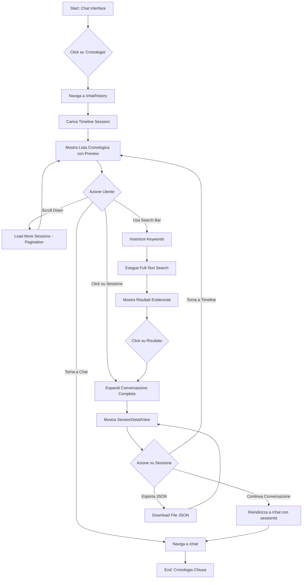

# FisioRAG UI/UX Specification

## Sezione 1: Introduction

Questo documento definisce gli obiettivi di esperienza utente, l'architettura dell'informazione, i flussi utente e le specifiche di progettazione visiva per l'interfaccia utente di FisioRAG. Serve come base per la progettazione visiva e lo sviluppo del front-end, garantendo un'esperienza coesa e centrata sull'utente.

**Change Log**

| Date | Version | Description | Author |
| :--- | :--- | :--- | :--- |
|      |         |             |        |

### Sezione 1.1: Overall UX Goals & Principles

#### Target User Personas
*   **Studente (MVP Focus)**: Utente principale che interagisce con la chat per ottenere risposte rapide e verificate a domande specifiche sul materiale di studio. L'obiettivo primario è la velocità e l'affidabilità.
*   **Admin (Professore)**: Utente secondario che gestisce il sistema, con un focus sulla semplicità d'uso per le operazioni di sincronizzazione e gestione accessi.

#### Usability Goals (con metriche suggerite)
*   **Accesso Rapido**: Lo studente deve poter inserire un codice e accedere alla chat in meno di 3 clic dalla pagina iniziale.
*   **Performance di Risposta**: La latenza end-to-end (P95) per una risposta deve essere inferiore a 8 secondi, con un indicatore di caricamento sempre visibile durante l'attesa.
*   **Verificabilità della Fonte**: L'accesso al testo sorgente originale di una citazione deve richiedere un solo clic.
*   **Chiarezza del "Fuori Contesto"**: Il messaggio che indica una domanda fuori ambito deve essere inequivocabile e non deve essere confuso con un errore del sistema.

#### Design Principles (rivisti)
1.  **Focus sulla Conversazione**: L'interfaccia deve dare priorità assoluta all'area di chat, riducendo al minimo la navigazione e gli elementi accessori.
2.  **Trasparenza Verificabile**: Il design deve rendere ovvio e facile per l'utente consultare le fonti originali di ogni informazione fornita.
3.  **Stile Accademico Essenziale**: L'estetica deve essere pulita, con alta leggibilità e un layout strutturato, evitando elementi grafici superflui o informali.
4.  **Feedback Visivo Costante**: Ogni stato del sistema (caricamento, successo, errore, domanda fuori contesto) deve essere comunicato all'utente in modo chiaro e immediato.

---

## Sezione 2: Information Architecture (IA)

#### Site Map / Screen Inventory

**Note su Stati e Flussi:**
*   **Flussi di Autenticazione**: I percorsi `A --> C` e `B --> D` non sono navigazioni dirette, ma rappresentano il successo di un flusso di autenticazione.
*   **Stati di Errore**: Le schermate `Accesso Studente` e `Login Admin` devono includere stati visivi per gestire e comunicare fallimenti (es. "Codice non valido", "Credenziali errate").
*   **Stati del Pannello Admin**: La vista `Sincronizzazione DB` includerà molteplici stati per fornire un feedback chiaro sul progresso dell'operazione (Inattivo, In corso con log testuale, Completato con successo, Errore).

#### Navigation Structure

*   **Primary Navigation**: Non esiste una navigazione primaria tradizionale. L'applicazione è divisa in due percorsi distinti e inaccessibili tra loro: il percorso Studente e il percorso Admin.
*   **Secondary Navigation (Admin Panel)**: All'interno del pannello di amministrazione, sarà presente una navigazione semplice (es. tab o link in una sidebar minimale) per passare tra "Gestione Codici" e "Sincronizzazione DB".
*   **Session Termination (Logout)**: Sia l'interfaccia Chat che il Pannello Admin conterranno un link di Logout discreto (es. nell'angolo in alto a destra) per terminare la sessione in modo sicuro.
*   **Breadcrumb Strategy**: Non necessaria data la bassa profondità dell'applicazione.

---

## Sezione 3: User Flows

#### Flow 1: Accesso Studente alla Chat
*   **User Goal**: Accedere all'interfaccia di chat per iniziare a porre domande.
*   **Entry Points**: Pagina principale dell'applicazione (`/`).
*   **Success Criteria**: L'utente viene reindirizzato all'interfaccia di chat (`/chat`) dopo aver inserito un codice valido.

**Flow Diagram**

**Edge Cases & Error Handling:**
*   Il codice inserito non è valido o è scaduto.
*   Nessun codice inserito (campo vuoto).
*   Errore di rete durante la validazione.

---
#### Flow 2: Interazione Principale (Domanda-Risposta)
*   **User Goal**: Porre una domanda, ricevere una risposta chiara, verificare le fonti e fornire un feedback.
*   **Entry Points**: Interfaccia di chat (`/chat`).
*   **Success Criteria**: La risposta del sistema viene visualizzata, le fonti sono consultabili e il feedback dell'utente viene registrato.

**Flow Diagram**

**Edge Cases & Error Handling:**
*   La domanda è ambigua o non pertinente.
*   Timeout del backend.
*   Errore di rete.
*   Fallimento nell'invio del feedback.

---
#### Flow 3: Sincronizzazione della Base di Conoscenza (Admin)
*   **User Goal**: Avviare la sincronizzazione dei documenti e monitorarne lo stato fino al completamento.
*   **Entry Points**: Pannello Admin (`/admin/dashboard`), sezione Sincronizzazione.
*   **Success Criteria**: Il processo di sincronizzazione viene completato con successo e l'admin riceve una notifica chiara dell'esito.

**Flow Diagram**

**Edge Cases & Error Handling:**
*   Nessun nuovo file da sincronizzare.
*   Fallimento nell'estrazione del testo da un file.
*   Errore API del servizio di embedding o LLM.
*   L'utente chiude la pagina durante la sincronizzazione.

---

#### Flow 5: Visualizzazione Cronologia Conversazioni (Epic 9)
*   **User Goal**: Accedere allo storico completo delle conversazioni passate, ricercare domande precedenti e riprendere sessioni.
*   **Entry Points**: Link "Cronologia" in Chat Interface (`/chat`), oppure accesso diretto a `/chat/history`.
*   **Success Criteria**: Lo studente visualizza lista conversazioni, può espandere singole sessioni, ricercare per keywords, ed esportare cronologia.

**Flow Diagram**

**Key Components (Epic 9 - Story 9.3)**:

1. **ConversationTimeline**: Lista sessioni con preview primo messaggio
   - Infinite scroll per performance (load more on scroll)
   - Formato: Data/ora, prima domanda (troncata), numero messaggi
   - Click su sessione → espande dettaglio

2. **HistorySearchBar**: Ricerca full-text con autocomplete
   - Debounced input (300ms delay)
   - Keyword highlighting nei risultati
   - Recent searches cache locale
   - Clear button

3. **SessionDetailView**: Espansione conversazione completa
   - Rendering messaggi user/assistant alternati
   - Citazioni espandibili (riusa popover esistente Story 3.4)
   - Export button (JSON download)
   - "Continue conversation" link (reindirizza a /chat)

**Edge Cases & Error Handling:**
*   Nessuna cronologia disponibile (nuovo utente): mostra empty state con messaggio incoraggiamento.
*   Errore caricamento cronologia: mostra messaggio errore generico con retry button.
*   Search query senza risultati: mostra messaggio "Nessun risultato trovato" con suggerimenti.
*   Export fallisce: mostra toast errore con possibilità retry.
*   Sessione non trovata (ID invalido): reindirizza a timeline con messaggio errore.

**Responsive Considerations**:
*   **Mobile**: Timeline a lista verticale singola colonna, search bar sticky top.
*   **Tablet**: Timeline con preview più ampie, 2 colonne se landscape.
*   **Desktop**: Timeline sidebar (30%) + SessionDetail main area (70%), split view.

**Accessibility Requirements**:
*   Timeline: Keyboard navigation (arrow keys), aria-live per "loading more".
*   Search: autocomplete lista con aria-activedescendant per screen readers.
*   SessionDetail: Skip links per navigare tra messaggi rapidamente.

---

## Sezione 4: Wireframes & Mockups

**Primary Design Files:** I design di dettaglio per l'interfaccia utente (mockup ad alta fedeltà e prototipi interattivi) saranno creati e mantenuti su Figma. Il link alla board di progetto è: `[Link a Figma da inserire]`

**Key Screen Layouts**: In questa fase non verranno prodotti wireframe a bassa fedeltà all'interno di questo documento. La progettazione visiva procederà direttamente su Figma, utilizzando i flussi utente e i principi di design qui definiti come guida. Se necessario, verranno create bozze concettuali direttamente nello strumento di design per esplorare rapidamente le opzioni di layout per le seguenti schermate chiave:
*   **Accesso Studente**: Layout a colonna singola con campo per il codice e pulsante di invio.
*   **Interfaccia Chat**: Layout classico con messaggi a scorrimento, campo di input fisso in basso.
*   **Pannello Admin**: Layout a due colonne con navigazione a sinistra e area contenuti a destra.

---

## Sezione 5: Component Library / Design System

**Design System Approach**: Per accelerare lo sviluppo e garantire coerenza e accessibilità, il progetto adotterà un approccio basato sulla libreria di componenti **Shadcn/UI**. Questa scelta permette di utilizzare componenti non stilizzati, accessibili (basati su Radix UI) e personalizzabili, che si integrano con React e Tailwind CSS. Non verrà creato un design system da zero. La personalizzazione estetica dei componenti seguirà rigorosamente il principio di **Stile Accademico Essenziale** definito in precedenza: palette di colori neutra, alta leggibilità del testo e layout puliti.

**Core Components**: I seguenti componenti di Shadcn/UI saranno fondamentali per la costruzione delle interfacce:

*   **Button**: Utilizzato per tutte le azioni (es. "Invia", "Accedi", "Avvia Sincronizzazione").
    *   *Varianti*: Primary, Destructive, Ghost.
    *   *Stati*: Default, Hover, Disabled, Loading (con spinner integrato).
*   **Input**: Per i campi di testo (Codice Studente, credenziali Admin, input della chat).
    *   *Stati*: Default, Focus, Disabled, Error.
*   **Card**: Usato come contenitore primario per i messaggi nella chat e per raggruppare visivamente le sezioni nel pannello admin.
*   **Popover**: Per visualizzare gli estratti delle fonti al click sulle citazioni.
*   **Alert / Toast**: Per mostrare notifiche di feedback a livello di sistema (es. "Sincronizzazione completata con successo", "Errore di rete").
*   **Table**: Per visualizzare dati strutturati nel pannello admin, come la lista dei codici di accesso generati.
*   **Progress**: Per visualizzare lo stato di avanzamento di operazioni lunghe, specificamente la sincronizzazione nel pannello admin.
*   **Spinner / Loader**: Componente generico per indicare stati di caricamento all'interno di altri componenti (es. bottoni) o a livello di pagina.

---

### Sezione 5.1: Form Validation

Per garantire un'esperienza utente coerente, robusta e sicura, la validazione dei form seguirà i seguenti standard:

*   **Libreria di Validazione**: Verrà utilizzata la libreria **Zod** per definire schemi di validazione sia lato client che lato server. Questo approccio garantisce una fonte unica di verità per le regole di validazione e previene la duplicazione della logica.

*   **Strategia di Validazione Client-Side**:
    *   La validazione verrà attivata `onChange` **dopo il primo evento `onBlur`** di un campo. Questo previene che l'utente veda messaggi di errore mentre sta ancora digitando.
    *   Il pulsante di "Submit" del form sarà disabilitato fino a quando tutti i campi non soddisferanno le regole di validazione.

*   **Strategia di Validazione Server-Side**:
    *   Ogni endpoint che riceve dati da un form rieseguirà la validazione utilizzando lo stesso schema Zod. Questa è una misura di sicurezza critica per proteggere l'API da richieste malformate.

*   **Esperienza Utente (UX) del Feedback di Errore**:
    *   **Messaggi**: I messaggi di errore devono essere chiari, concisi e in italiano. Devono essere visualizzati direttamente sotto il campo a cui si riferiscono.
    *   **Stato Visivo**: Un campo con un errore di validazione deve avere uno stato visivo distintivo (es. bordo rosso), come definito dagli stati dei componenti in Shadcn/UI.

---

## Sezione 6: Branding & Style Guide

**Visual Identity & Theming**: Non sono richiesti elementi di branding specifici. Lo stile sarà neutro, pulito e professionale. L'applicazione **deve supportare sia un tema Chiaro (Light) che uno Scuro (Dark)**. Il tema di default dovrebbe rispettare la preferenza di sistema dell'utente, con la possibilità di un toggle manuale per forzare una delle due modalità.

**Color Palette (Semantic Theming)**: Per supportare entrambi i temi, i colori saranno definiti semanticamente. La libreria Shadcn/UI supporta nativamente questo approccio. Si raccomanda di usare una palette basata su toni neutri per la base e un colore accento per l'interattività.

| Nome Semantico | Light Mode (Colore) | Dark Mode (Colore) | Utilizzo |
| :--- | :--- | :--- | :--- |
| `background` | Bianco / Grigio Chiarissimo | Nero / Grigio Scurissimo | Sfondo principale dell'applicazione |
| `foreground` | Nero / Grigio Scuro | Bianco / Grigio Chiaro | Testo principale |
| `card` | Bianco | Grigio Scuro | Sfondo dei contenitori (es. messaggi chat) |
| `card-foreground` | Nero / Grigio Scuro | Bianco / Grigio Chiaro | Testo all'interno dei contenitori |
| `primary` | Blu Vivace | Blu Vivace | Colore principale per bottoni e elementi interattivi |
| `primary-foreground`| Bianco | Bianco | Testo su elementi con sfondo `primary` |
| `border` | Grigio Medio-Chiaro | Grigio Medio-Scuro | Bordi e separatori |
| `input` | Grigio Chiaro | Grigio Scuro | Sfondo dei campi di input |
| `success` | Verde | Verde (tono più chiaro) | Notifiche di successo |
| `destructive` / `error`| Rosso | Rosso (tono più chiaro) | Notifiche di errore, azioni distruttive |

**Typography**:
*   **Font Families**: Si conferma l'uso di un font di sistema sans-serif (es. Inter o stack di sistema) per performance e leggibilità. Il colore del testo seguirà le variabili `foreground` e `card-foreground` definite sopra per adattarsi automaticamente al tema.
*   **Type Scale**: Sarà definita una scala tipografica chiara e gerarchica. La dimensione del corpo del testo non sarà inferiore a 16px per garantire la leggibilità.

---

## Sezione 7: Accessibility Requirements

**Compliance Target**: L'applicazione punterà a raggiungere la conformità con le **Web Content Accessibility Guidelines (WCAG) 2.1 di livello AA**. Tutti i requisiti devono essere soddisfatti sia in tema Chiaro (Light) che Scuro (Dark).

**Key Requirements (General)**:
*   **Color Contrast**: Rapporto di contrasto minimo di 4.5:1 per testo normale e 3:1 per testo grande.
*   **Keyboard Navigation**: Piena funzionalità tramite tastiera con un ordine di focus logico.
*   **Semantic HTML**: Uso corretto di HTML semantico per la struttura.
*   **Form Labels**: Etichette associate a tutti gli input.
*   **Visible Focus Indicators**: Indicatori di focus chiari su tutti gli elementi interattivi.

**Application-Specific Requirements**:
*   **Dynamic Content (Chat & Sync Log)**: Le aree che ricevono contenuti in tempo reale (la cronologia della chat e il log di sincronizzazione) **devono** utilizzare regioni `aria-live`. Questo assicura che i nuovi messaggi e gli aggiornamenti di stato vengano annunciati automaticamente dagli screen reader.
*   **Interactive Source Popovers**: I popover delle fonti devono essere pienamente accessibili. Il controllo che li attiva (la citazione) deve essere un `<button>` e deve comunicare il suo stato (aperto/chiuso) tramite l'attributo `aria-expanded`. Il contenuto del popover deve essere raggiungibile via tastiera una volta aperto.
*   **Theme Toggle**: Il controllo per cambiare tema deve essere accessibile da tastiera e comunicare lo stato corrente (es. "Tema Chiaro Attivo").

**Testing Strategy**:
L'accessibilità sarà una responsabilità condivisa e continua:
1.  **Design**: I controlli di contrasto colore saranno effettuati direttamente in Figma per entrambi i temi.
2.  **Sviluppo**: Verranno utilizzati strumenti di linting e analisi statica per l'accessibilità nel codice.
3.  **CI/CD Pipeline**: Ad ogni commit, verranno eseguiti test di accessibilità automatici (es. con Axe) per prevenire regressioni.
4.  **Pre-Release**: Verranno condotti test manuali completi di navigazione da tastiera e con screen reader (NVDA/VoiceOver) prima di ogni rilascio.

---

## Sezione 8: Responsiveness Strategy

**Approccio Generale**: Verrà adottato un approccio **mobile-first**, progettando primariamente per schermi piccoli e adattando progressivamente il layout a viewport più grandi.

**Breakpoints**: Si utilizzeranno i breakpoint standard di Tailwind CSS.

| Breakpoint | Min Width | Target Devices |
| :--- | :--- | :--- |
| `sm` | 640px | Telefoni in modalità orizzontale, tablet piccoli |
| `md` | 768px | Tablet |
| `lg` | 1024px | Laptop, desktop a bassa risoluzione |
| `xl` | 1280px | Desktop a risoluzione standard e superiore |

**Pattern di Adattamento per Layout**:

*   **Layouts Semplici (Accesso / Login)**: Manterranno una struttura a colonna singola centrata su tutti i dispositivi, adattandosi in larghezza.

*   **Layout Complesso (Admin Panel)**:
    *   **Desktop (`md` e superiori)**: Layout a due colonne con una sidebar di navigazione fissa a sinistra e l'area del contenuto a destra.
    *   **Mobile (`sm` e inferiori)**: La sidebar di navigazione collasserà per dare priorità al contenuto. Sarà accessibile tramite un controllo standard (es. icona "hamburger") per non occupare spazio prezioso.

**Strategia Specifica per l'Interfaccia Chat**:

*   **Gestione della Tastiera a Schermo (Critico)**: L'interfaccia della chat **deve** adattarsi in modo intelligente quando la tastiera virtuale è visibile su mobile. L'area di input del testo deve rimanere agganciata sopra la tastiera, e l'area di visualizzazione dei messaggi deve ridimensionarsi per occupare lo spazio rimanente, permettendo all'utente di scorrere la conversazione mentre digita.

**Principi di Usabilità Mobile**:

*   **Touch Targets Ampi**: Tutti gli elementi interattivi (bottoni, link, input) devono avere una dimensione minima di 44x44px per essere facilmente cliccabili con le dita.
*   **Leggibilità**: La dimensione del font del corpo del testo non deve mai scendere al di sotto di 16px per garantire la leggibilità su schermi piccoli.
*   **Priorità al Contenuto**: Su schermi piccoli, il contenuto e le azioni primarie devono essere immediatamente visibili senza necessità di scorrimento orizzontale.

---

## Sezione 9: Animation & Micro-interactions

**Motion Principles**: Le animazioni devono essere **funzionali, discrete, performanti e accessibili**.
1.  **Funzionali**: Devono migliorare la comprensione dell'interfaccia, non decorarla.
2.  **Discrete**: Devono essere rapide e non intrusive, senza ostacolare l'utente.
3.  **Performanti**: Devono essere implementate usando tecniche che non impattano negativamente la fluidità dell'interfaccia (es. preferire `transform` e `opacity`).

**Accessibility (`prefers-reduced-motion`)**:
Tutte le animazioni e le transizioni **devono** essere disabilitate o significativamente ridotte quando il sistema operativo dell'utente ha l'impostazione "Riduci movimento" abilitata. Questa è una requisito non negoziabile.

**Key Animations & Micro-interactions**:
*   **Bot Typing Indicator**: Quando il backend sta elaborando una risposta, l'interfaccia **deve** mostrare un indicatore animato di "sta scrivendo" per gestire l'aspettativa dell'utente e rendere l'attesa più naturale.
*   **Apparizione dei Messaggi in Chat**: I nuovi messaggi appariranno con una sottile animazione di "fade-in" e scorrimento.
*   **Stati dei Controlli Interattivi**: Bottoni e input avranno transizioni di colore e/o scala fluide tra i loro stati (hover, focus, active) per fornire un feedback immediato.
*   **Popover e Notifiche**: L'apertura e la chiusura di popover e notifiche (toast) avranno transizioni discrete di opacità e posizione per rendere le loro apparizioni meno brusche.

---

## Sezione 10: Performance Considerations

**Performance Goals**:
*   **Time to Interactive (TTI)**: L'applicazione deve diventare interattiva (l'utente può digitare nel campo di input) in meno di 3 secondi su una connessione 3G lenta.
*   **UI Responsiveness**: Le interazioni all'interno dell'interfaccia (click, digitazione) devono fornire un feedback visivo in meno di 100ms, senza lag o "jank".
*   **End-to-End RAG Latency**: La latenza media per ricevere una risposta dal backend (P95) deve rimanere sotto gli 8 secondi.

**Design & Implementation Strategies**:

*   **List Virtualization (Chat Interface) [CRITICO]**: Per garantire una performance fluida anche con conversazioni molto lunghe, la cronologia dei messaggi **deve** essere implementata utilizzando una tecnica di virtualizzazione (o "windowing"). Questo significa che verranno renderizzati nel DOM solo i messaggi attualmente visibili, mantenendo l'uso della memoria e il carico di rendering costanti indipendentemente dalla lunghezza della cronologia.

*   **Strategic Code Splitting**: Il codice sarà suddiviso per route. Il bundle iniziale conterrà solo il minimo indispensabile per le pagine pubbliche. Il codice per la Chat e il Pannello Admin verrà caricato dinamicamente solo dopo che l'utente si è autenticato con successo.

*   **Bundle Size Management**: Verrà posta un'attenzione costante alla dimensione del bundle JavaScript. Si eviteranno dipendenze pesanti e si analizzerà il bundle per identificare e ottimizzare le parti più grandi.

*   **Perceived Performance**: Data la latenza inevitabile del backend (fino a 8s), la UX deve gestire l'attesa in modo eccellente. L'uso dell'indicatore di "sta scrivendo", come definito nella sezione Animazioni, è cruciale per migliorare la percezione della velocità e ridurre la frustrazione dell'utente.

---

## Sezione 11: Next Steps & Design Handoff

**Immediate Actions**:
1.  **Revisione e Approvazione**: Questo documento deve essere revisionato e approvato dal **Product Manager e dal Lead Developer** per garantire l'allineamento tra requisiti di prodotto e fattibilità tecnica.
2.  **Sessione di Allineamento Design-Sviluppo**: Prima di iniziare la progettazione ad alta fedeltà, si terrà una breve sessione congiunta per rivedere i componenti Shadcn/UI scelti. L'obiettivo è assicurare che i design proposti in Figma siano basati su questi componenti per massimizzare la velocità di implementazione.
3.  **Progettazione Iterativa in Figma**: Si procederà con la progettazione delle schermate chiave in Figma. I design saranno condivisi con gli sviluppatori man mano che vengono creati per un feedback rapido, invece di attendere un "handoff" finale.

**Design Readiness Checklist (for Development)**:
Il design sarà considerato "pronto per lo sviluppo" quando i seguenti artefatti saranno disponibili in Figma, con una revisione continua insieme al team di sviluppo:

*   [ ] **Accesso in Lettura al Progetto Figma**: Link condiviso e sempre aggiornato per il team.
*   [ ] **Mockup Statici Completi**: Viste per le schermate chiave (Accesso, Chat, Admin Panel) che coprono gli stati principali (default, errore, vuoto) per entrambi i temi (Light/Dark).
*   [ ] **Guida di Stile Ispezionabile**: Specifiche chiare per colori, tipografia e spaziature direttamente ispezionabili in Figma.
*   [ ] **Note sulle Micro-interazioni**: Brevi note che descrivono le animazioni chiave (es. durata, tipo di easing), senza la necessità di prototipi completi per ogni interazione.
*   [ ] **Risorse Essenziali Esportabili**: Eventuali icone o asset grafici disponibili in formato SVG.
